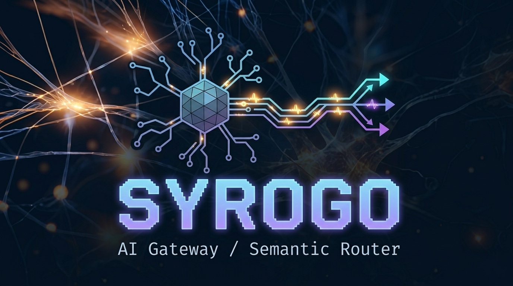

# Syrogo

中文 | [English](./README.md)

<p align="center">
  
</p>

> Syrogo · AI Gateway / Semantic Router
>
> 用更清晰的边界、多协议接入和面向网关的编排能力，承接多模型流量。

- **多协议入口** — 在同一个网关中统一承接 OpenAI Chat、OpenAI Responses 与 Anthropic Messages。
- **面向真实场景的路由** — 支持按 client tag、目标模型、failover 与 round_robin 进行调度。
- **面向上游适配的执行层** — 接多个 provider，而不把协议差异散落到每个客户端里。

Syrogo 是一个面向多模型场景的 AI Gateway / Semantic Router。

它不是只做单一协议转发的代理层，而是一个放在客户端与上游模型之间的中间系统，用来统一承接：
- 多种入口协议
- 多上游 provider 接入
- 按客户端场景进行路由
- failover / round_robin 等基础调度
- 后续额度切换、统计、治理与多节点串接能力

当前项目仍处于 0→1 骨架建设阶段，优先目标是把服务主链路、协议边界与路由模型打稳。

---

## 名字的由来

Syrogo 这个名字结合了神经元 / Synapse 的意象、Router 的路由语义，以及 Go 的实现身份。

它想表达的是：模型流量像神经信号一样被连接、传递与分发，而系统本身则是一个用 Go 构建的网关与路由层。

---

## 为什么做这个项目

真实模型接入场景里，客户端协议、上游协议、模型命名、鉴权方式、稳定性策略都不统一。

Syrogo 想解决的不是“再包一层 HTTP”，而是把这些变化收敛到清晰边界内：
- 客户端按自己熟悉的协议接入
- 系统内部转换成统一中立模型
- 路由层只关注流量该去哪
- provider 层只关注如何对接具体上游
- 最终再按客户端期望的协议输出

这样可以让接入、路由、切换、治理彼此解耦，而不是散落在每个 provider 或每条 handler 分支里。

---

## 设计原则

- 先做最小可运行闭环，再做能力扩展
- 优先稳定 `cmd + internal` 分层，不为了“看起来标准”提前拆 `pkg`
- `gateway` 负责入口协议解析与响应序列化
- `runtime` 负责中立请求、响应与流事件模型
- `router` / `execution` 负责路由决策与执行，不承担协议适配
- `provider` 负责出站协议编码、上游调用与结果解码
- 流式与非流式尽量共享同一套内部抽象，只在边界层做协议映射

---

## 当前已实现能力

当前版本已经支持：

- Go HTTP 服务启动与优雅退出
- 配置加载与基础校验
- `GET /healthz`
- 单监听与多监听配置
- 每个 listener 可绑定不同入口
- 三类入口协议
  - `POST /v1/chat/completions`
  - `POST /v1/responses`
  - `POST /v1/messages`
- 按客户端场景进行 tag-first routing
- 单条规则内支持：
  - `failover`
  - `round_robin`
- 支持按路由指定目标模型
- 多类出站协议
  - `mock`
  - `openai_chat`
  - `openai_responses`
  - `anthropic_messages`
- OpenAI-compatible 与 Anthropic-compatible 上游调用
- 基础 SSE 流式返回
- 最小 tool calling 闭环
- `openai_responses` 的兼容能力声明
- 本地开发日志与 trace 调试能力
- 关键链路单元测试、回归测试与流程测试

---

## 项目结构

```text
cmd/
  syrogo/                    # 程序入口

internal/
  app/                       # 应用装配
  config/                    # 配置定义、加载、校验
  execution/                 # 执行计划消费与 fallback
  eventstream/               # 中立流事件整理与快照
  gateway/                   # inbound protocol / HTTP handler / 响应序列化
  provider/                  # outbound protocol / 上游适配
  router/                    # tag-first 路由决策
  runtime/                   # 中立标准模型
  server/                    # HTTP server 生命周期

configs/
  config.example.yaml        # 功能展示版配置
  config.yaml                # 本地手测配置（已 gitignore）
```

---

## 快速开始

### 1. 准备配置

从示例配置复制一份本地配置：

```bash
cp configs/config.example.yaml configs/config.yaml
```

然后把 `configs/config.yaml` 中的 token、endpoint、auth_token 改成你本地可用的真实值。

注意：当前实现不会自动读取 `.env`，也不会自动展开 `${VAR}`。如果配置文件里保留占位符字符串，它会被原样读入。

### 2. 选择监听与入口

当前既支持单监听，也支持多监听：

- `server.listen`：单监听
- `listeners[]`：多监听

使用 `listeners[]` 时，可以把不同入口挂到不同端口，按场景暴露不同协议。

### 3. 从 GitHub Releases 下载

如果你不想从源码构建，可以直接从 GitHub Releases 下载预编译压缩包。

当前计划提供的发布制品平台：
- Linux amd64 / arm64
- macOS amd64 / arm64

下载后解压，直接运行其中的 `syrogo` 二进制即可。

### 4. 启动服务

优先使用：

```bash
make run
```

如果只想做最小本地验证，也可以把某个 route 指到 `mock` outbound。

### 5. 检查健康状态

```bash
curl http://127.0.0.1:8080/healthz
```

如果你的监听端口不是 `:8080`，请按实际配置替换。

### 6. 验证协议入口

当前建议优先验证：
- `POST /v1/chat/completions`
- `POST /v1/responses`
- `POST /v1/messages`

### 7. 声明 Responses 兼容能力

如果某个 `openai_responses` 上游只兼容官方 Responses 的一部分能力，可以在 outbound 上显式声明能力边界：

```yaml
outbounds:
  - name: "responses-primary"
    protocol: "openai_responses"
    endpoint: "https://api.openai.com/v1"
    auth_token: "${OPENAI_RESPONSES_API_KEY_PRIMARY}"
    tag: "responses-primary"
    capabilities:
      responses_previous_response_id: true
      responses_builtin_tools: true
      responses_tool_result_status_error: true
      responses_assistant_history_native: true
```

### 8. 本地调试

本地开发时可使用：

- `--dev-log`：把日志同时输出到 stdout 与 `tmp/dev.log`
- `SYROGO_TRACE=1` 或 `SYROGO_TRACE=full`：输出 trace 调试文件到 `tmp/trace`

更细的协议语义、调试开关与维护约束，请看：
- `.claude/rules/architecture.md`
- `.claude/rules/engineering.md`

---

## 当前边界

当前阶段还**不追求**：

- 复杂插件系统
- gRPC / MCP / WebSocket 等额外接入层
- 完整 semantic routing
- 对外 Go SDK 或 `pkg` 级公共库抽象
- 为未来假设需求提前搭建平台层
- multimodal 全量无损支持
- 所有上游协议能力的一比一透传

当前更重要的是：

**先把协议入口、内部抽象、路由执行与 provider 边界稳定下来。**

---

## Roadmap

接下来优先推进的方向：

- 持续稳固多协议入口与多协议出站闭环
- 继续增强 routing、fallback、round_robin 的可验证性
- 完善 provider 适配边界与错误分类
- 逐步补齐治理相关能力
  - 额度切换
  - 统计
  - 多节点串接
- 在不破坏主链路抽象的前提下，再扩展更多 provider 与协议能力

---

## 说明

这份 README 主要面向项目介绍、功能边界、配置用法和使用入口。

更细的链路维护知识、协议边界、流式抽象、测试门槛与改动 guardrails，统一沉淀在 `.claude/rules` 中，避免产品说明与开发规则混写。
